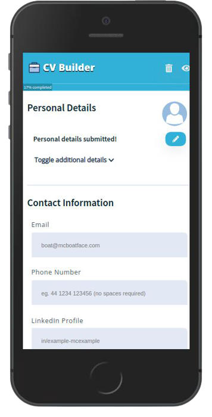

# Task Planner



A React-based, fully responsive resume builder. It is built around the idea of a custom template, which is populated with user-provided data. Each form field features its own validation logic and the app allows to both preview & download an interactive PDF. This project was a lovely chance to practise with Styled Components and custom React hooks.
<br>
<br>**Important Note**: **None** of the data provided leaves the client-side.
<br>
<br>**Important Note #2**: Since the PDF implementation is based on _React-to-PDF_, certain limitations may apply browser and device-wise. I would recommend accessing the app through Chrome for the time being.

## Installation

As this project was bootstrapped with React, the following scripts are available:

**Install** the dependencies:

```
npm install
```

Run the app in **development** mode:

```
npm start
```

Launch the **test server** in the interactive watch mode:

```
npm test
```

## Features

- Independent, custom field validation
- Interactive progress bar that adjusts based on provided data
- Responsive image adjustment for the profile photograph
- Custom toggle component

## Tech

- React
- Lodash
- React-to-Print
- Styled Components
- FontAwesome

For a more detailed overview of the development & production dependencies, please check `package.json`.

## Live Version

<https://developedbygeo.github.io/Resume-builder/>

## Contributing

Contributions are certainly welcome. Please feel free to open an issue/PR if there is something you would like to be changed.

## Acknowledgements

A massive thank you to The Odin Project & freeCodeCamp for their guidance and quality material.

## License

[MIT](./LICENSE.md)
